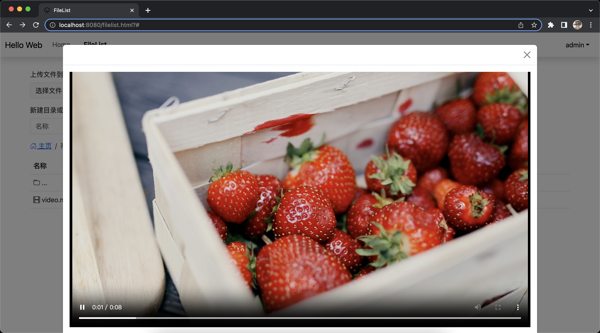

# java-web-exp

### 2023春季学期java课程作业

##### 项目名称：在线文件管理器

##### 技术栈：   

- 前端：
  - Vue2.x
  - axios ajax请求库
  - bootstrap5.x ui库
  - bootstrap icon icon库
  - quill.js实现文本编辑
- 后端
  - springboot3
  - mysql数据库

##### 开发周期：4天（6-17-6.20）

### 功能完成情况

- [x] 用户注册、登陆验证
- [x] 用户信息获取
- [x] 目录导航、子目录创建、目录下文件展示
- [x] 创建文本文件（txt）
- [x] 批量上传文件
- [x] 查看文件、删除文件
- [x] 编辑文本文件并保存
- [x] 拖拽移动文件到文件夹内
- [x] 拖拽移动文件到上一级目录
- [x] 按住ctrl/command多选文件删除
- [x] 缓存用户上次查看的目录
- [x] 部分加了键绑定 比如esc退出查看 非流媒体空格也可以退出
- [ ] 后端的表单校验

### 软件功能说明

注：

1. 进入目录或打开文件需要双击
2. 只有按住cmd或ctrl选择文件后删除图标才会出现
3. 拖拽功能仅支持单个拖拽（主要是没有实现多个同时被拖拽的样式问题）

#### 核心功能为文件管理

- 登陆注册    
  - 首次访问没有登陆需要先注册登陆
  - 注册与登陆页可以相互跳转
- 支持用户上传文件到当前目录
  - 支持批量上传
  - 最大单个文件不超过20m
  - 不支持上传目录

- 支持创建目录到当前目录
  - 不支持选择路径创建，如需在创建到某个目录下，需先进入这个目录，或者创建完移动进去
- 可以创建文本（txt）文件到当前目录
  - 不支持选择路径，只能创建txt，不需要写文件格式
- 支持网页上拖拽文件到文件夹或上一级目录
  - 目前仅支持单个拖拽，拖拽过程会有样式提示，可以拖进去的背景色会变蓝
  - 支持拖拽文件或目录
- 按住cmd/ctrl多选文件后删除
  - 按住cmd或ctrl可以多选
  - 删除按钮只有在多选后才出现
- 可以完整浏览用户所有的目录和文件，文件导航和返回上一级
  - 文件导航功能完整，支持跳转到点击的位置
  - 当前目录不可点击
  - 非根目录文件列表第一个为...名称的文件夹，双击返回上一级目录
- 可以查看大部分流行文件（pdf，流媒体，图片等）
  - 不可查看的文件类型会提示不可查看
  - 流媒体文件支持倍速控制，下载，音量控制等
  - pdf支持下载
- 支持编辑txt文本文件并保存
  - 如果打开的文件为txt文本文件，则自动进入编辑
  - 退出或保存都可以保存文件到服务器
- 缓存用户上次查看的目录，下次进入网站时会自动跳转到上次访问的目录
  - 组件销毁时会缓存当前用户访问的目录
  - 下次进入该页面会优先显示上次访问的目录

#### 功能图


#### 核心功能实现介绍

#####  文件列表的渲染

1. 数据库 file表	

|   id   | user_id | parent_id          | name   | type     | size     | path         | updated  | status   |
| :----: | ------- | ------------------ | ------ | -------- | -------- | ------------ | -------- | -------- |
| 文件id | 用户id  | 父文件id（根为-1） | 文件名 | 文件类型 | 文件大小 | 文件存储路径 | 更新时间 | 是否删除 |

2. 接口返回的是当前用户所有的文件

3. 前端得到的是一个扁平的数组，需要处理成树状，核心实现如下

   ```js
   // 处理文件 将扁平的列表变为树状 添加类型信息
   handlerFileList(list,pid){
     const result = [];
     // 遍历列表，找到指定 parentId 的对象
     for (const item of list) {
       if (item.parent_id == pid) {
         // 递归调用
         const children = this.handlerFileList(list, item.id);
         item.children = children
         result.push(item);
       }
     }
     return result;
   },
   ```

4. 初始化数据之后访问时只需要根据pid找到对应item的children即可，查询逻辑如下

   ```js
   // 根据parent_id获取对应节点的children
   	findChildren(pid){
     	if(pid == -1) return this.filelist; // pid为-1表示当前文件在根目录下，直接返回总的list
     	return this.getFileListById(this.filelist,pid)	
   	},
   	// 递归查询对应pid的children
     getFileListById(list,pid){
       for(const item of list){
         if(item.id == pid)
           return item.children
         if(item.children && item.children.length > 0 ){
           const result = this.getFileListById(item.children,pid)
           if(result){
             return result
           }
         }
       }
       return null
     },
   ```

##### 目录导航功能

1. 导航：    

   - 使用curPath对象数组变量存储导航栏信息，每个对象中包括当前目录的目录`id`和`folder_name`

   - 点击导航栏时获取该item下的id，通过上述`findChildren()`函数找到对应的`children`

   ```js
   // 点击导航栏进入目录
   navigateTo(item){
     let i = this.curPath.indexOf(item) // 获取点击item在路径中的索引
     if(i == this.curIndex) return // 当前路径点击无效
     this.curPathIndex = i
     this.curlist = this.findChildren(item.id) // 更新当前列表
     this.curPath.splice(i+1) // 删除导航栏路径的元素
   },
   ```

2. 点击目录进入
   - 将目标元素的`children`赋值给当前列表
   - 并将目标元素的对应信息push到导航栏路径

##### 文件拖拽功能

注意点

- 将`tr`标签`draggable`属性设置为`true`
- 给`tr`绑定`drapstart,dragover,dragleave,drop`方法
- 其中`dragover`需要禁止默认事件

1. dragstart    

   - 开始拖动的函数，记录起始索引

   - 代码：

     ```js
     // 开始拖动文件的起始索引
     onDragStart(index){
       this.curSelectIndex = index
     },
     ```

2. dragover

   - 拖动过程执行，检测当前鼠标下的元素是否为folder类型 如果是给该元素添加高亮样式

   - 代码：

     ```js
     // 拖动过程
     dragOver(event, index) {
       event.preventDefault() // 要阻止默认事件drop才能生效
       if(index == -1){ // 上一级目录的index为-1
         this.isHoveringGoBack = true
         return
       }
       const item = this.curlist[index]
       if(item.type == "folder"){
         item.isHovering = true
       }
       
     }
     ```

3. dragleave

   - 离开元素时执行

   - 离开folder以后将对应样式移除

   - 代码：

     ```js
     // 离开后让取消样式
     dragLeave(item){
       if(item == null){
         this.isHoveringGoBack = false
         return 
       }
       item.isHovering = false
     }
     ```

4. drop

   - 鼠标松开执行，即释放拖动的元素

   - 判断当前文件是否为文件夹或者是否是“上一层”的，如果是更新文件列表和导航路径

   - 代码：

     ```js
     // 释放时
     drop(event, index) {
       event.preventDefault();
       const draggedIndex = this.curSelectIndex
       const draggedItem = this.curlist[draggedIndex];
       var	 targetItem = null
       if(index != -1){
         targetItem = this.curlist[index]
         targetItem.isHovering = false;
       }
     
       if(draggedIndex==index) return 
       if(index == -1){
         let pid = this.curPath[this.curPathIndex - 1].id
     
         this.changeFilePosition(draggedItem.id,pid)
         this.curlist.splice(draggedIndex, 1);
         return 
       }
       if (targetItem.type === 'folder' ) {
         // 将拖拽的文件或文件夹放入目标文件夹中
         targetItem.children.push(draggedItem);
         // 改变文件位置
         this.changeFilePosition(parseInt(draggedItem.id),targetItem.id)
         // window.location.reload();
         // 从原位置删除拖拽的文件或文件夹
         this.curlist.splice(draggedIndex, 1);
       }
     },
     ```

##### 多选文件并删除

本来想做多选拖拽功能的，然后可以实现拖拽进入但是没法在拖拽过程中让所有被选中的元素都被拖起来，后来就想着多选都实现了干脆顺便实现删除，这就有了只有按住cmd/ctrl多选后才显示删除的特点

1. 多选：

   - 按住cmd/ctrl多选

   - 被选择的行都会添加一个背景色

   - 代码：

     ```js
     // created钩子里添加监听
     window.addEventListener('keydown', this.onKeyDown);
     window.addEventListener('keyup', this.onKeyUp);
     // 按住cmd可以多选
     onFileClick(index, $event){
       if (this.isCmdPressed) {
         // 按住Command键时，切换文件的选中状态
         this.curlist[index].selected = !this.curlist[index].selected;
       } else {
         // 未按住Command键时 清空已选中
         this.clearSelection();
       }
       this.updateSelectedIds();
     }
      onKeyDown(event) {
        if (event.key === 'Meta' || event.key === 'Control') {
          // Command键按下时设置isCommandPressed为true
          this.isCmdPressed = true;
        }
      },
        onKeyUp(event) {
          if (event.key === 'Meta' || event.key === 'Control') {
            // Command键释放时设置isCommandPressed为false
            this.isCmdPressed = false;
          }
        },
     ```

2. 删除

   - 删除文件或文件夹

   - 因为可能删除的可能会是文件夹，就需要把其下的所有文件和文件夹都删除

   - 实现思路：先找递归找到所有要删除的文件/文件夹id 形成列表 再遍历这个id列表依次进行删除请求

   - 代码：

     ```js
     // 删除文件
     delFiles(){
       // 如果时文件夹 那么要删除这个文件夹下所有的 文件 或 文件夹
       var ids = []
       this.selectedIds.forEach(id=>{
         let res = this.findChildren(id) // n根据这个id找到对应元素children
         ids.push(id)
         if(res.length > 0) // 如果有子元素 也就是如果是folder
           ids = ids.concat(this.findIdsWithChildren(res)) // 递归执行并拼接id数组
         // 最后再将本地的移除 不强制刷新是为了 提高用户体验 避免删除出问题时不提示用户
         const index = this.curlist.findIndex(obj => obj.id === id);
         if (index !== -1) {
           this.curlist.splice(index, 1);
         }
       })
       ids.forEach(id=>{
         this.delFileRequest(id) // 依次调用删除请求
       })
       this.selectedIds = []
       // this.refresh()
     },
        // 找到该对象下所有的元素id
       findIdsWithChildren(objects) {
         let ids = [];
         for (let obj of objects) {
           ids.push(obj.id);
           if (obj.children && obj.children.length > 0) {
             let childIds = this.findIdsWithChildren(obj.children);
             ids = ids.concat(childIds);
           }
         }
         return ids;
       },
     ```

##### 查看文件内容和编辑

- 只能编辑txt类型的文件 其他类型的文件都会尝试用object标签渲染，支持就渲染，不支持就会提示不支持

- 虽然object有点过时了，不过完成一个期末作业还是绰绰有余的，因为之前没有写过类似的功能，又是最后写个这个查看功能，还是被卡了挺久的，最后竟然是因为响应类型的声明位置不对，真的哭死。。。

- 没什么太多要解释的了，就是后端返回二进制流，前端拿blob对象接一下，生成对应url，匹配一下数据类型直接渲染就可以，就是object标签似乎不能重复使用，所以dom要动态生成一下

- 填装object用的bootstrap的modal 不新开一个标签体验感会好一点

- 代码：

  ```js
  // 获取文件数据的请求
  getFileDataRequest(id){
    axios.get('/file/fileData',{
      params:{ id: id },
      responseType: 'blob'
    })
      .then(response => {
      const contentType = response.headers['content-type'];
      const fileData = new Blob([response.data], { type: contentType });
      const url = URL.createObjectURL(fileData);
      console.log(url)
      this.curOpenType = contentType //  保存当前文件类型 用于做绑定按键的选择性判断
      // console.log(contentType)
      if(contentType.includes("text")) this.editingFileId = id
      this.hanlerFileData(contentType,fileData,url) // 根据不同的文件类型做出处理
    })
      .catch(error => {
      alert("出错啦！")
      console.error('获取文件数据失败:', error);
    });
  },
    hanlerFileData(contentType,fileData,url){
      // 处理文本和非文本
      if (contentType.includes('text')) {
        this.isObject = false
        const reader = new FileReader();
        reader.onload = (event)=> {
          const content = event.target.result; // 获取文件内容
          this.initEditor(content)
        };
  
        reader.readAsText(fileData);		    	
      }
      // 非文本统一用object接收
      else {
        this.isObject = true
        var objEle = document.createElement('object');
        // 设置属性和内容
        objEle.data = url;
        objEle.type = contentType;
        objEle.classList.add("objEleClass")
        document.getElementById("obj-container").innerHTML = '';
        document.getElementById("obj-container").append(objEle)
      }
      document.getElementById("openModal").click()
    },
    
  ```

  

##### 后端部分

- 后端没什么难点好像，一开始想用springboot依赖注入 entity repository service controller这几个模块开发，研究了好久不知道为啥语法没有问题但是我的eclipse扫描不到，期间也尝试过idea，由于数据库的依赖注入也不行就干脆放弃了这种开发思路，就用了最朴素的虽然套着springboot的壳子但是十分不springboot的奇怪后端，总之功能都实现了，因为只有两个表，所以即使不用框架也挺简单的，都是基本的增删改查和springboot的语法糖，或者一些不知道的java语法，总之几乎稍微复杂一点的逻辑处理我都放在了前端，后端都是比较直接的存储文件和sql语句操作数据库。
- 唯一比较遗憾的就是没有写验证和没有分模块管理后端（其实就是我懒得写，主要是还有别的大作业5555），虽然前端我也用脚手架，但因为之前有过前端的经验了也就无所谓了，本来想好好研究一下springboot结果还是几天草草了事了，还是有一丢丢可惜的。


##### 除了鲁棒性的问题还有的小bug

- 文件名中文的时候有些unicode编码很长，我没有注明编码模式，懒得找了，后端控制台会报这个错

### 项目运行截图（基本界面）

- 主页

  

- 文件列表页

  

- 查看图片

  

- 查看pdf

  

- 播放视频

  

- 播放音频

  

- 查看并编辑文本文件

  


### 项目录屏演示

如果打不开就点击assets文件里查看

文件太大了就降低了分辨率和帧率

<video src="./README.assets/java-web演示视频.mov"></video>


### 最后关于我的提交记录为什么从6.17号开始

因为之前电脑坏掉了，这不是主要的，毕竟我推了gitlab，主要是想重构一下用springboot，就一直拖着，一直在研究怎么注入怎么扫描之类了巴拉巴拉，最后还是没用成。。。真的烦！现在这个写的……也太不优雅了，这两天一直在肝，不少都是凌晨提交的，不过写完也是真的有成就感，虽然勉勉强强完成了要求的功能，但是确实很开心，有一种莫名其妙的快乐hhhh

ok fine 结束啦 谢谢你看到这 如果你看到这了的话。   

--raining 
